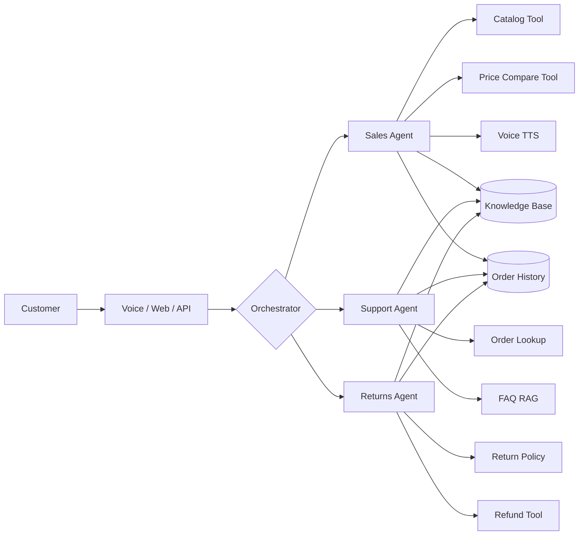
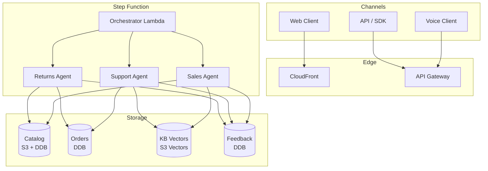

# RetailPulse

> Multi-agent customer experience (CX) suite for retail. Three cooperating agents — Sales, Support, and Returns — share a knowledge base, take natural-language requests, and act on a real retail catalog and order history. Config-driven, cloud-portable, voice-enabled.

[](LICENSE)


---

## What this solves

Retailers lose ~$1.6T/year to cart abandonment and ~$50B/year to inefficient returns. Existing chatbots are scripted, can't browse competitor pricing, can't voice-interact, and can't reason over a real order history. RetailPulse is a single CX agent team that handles the full shopping lifecycle — from product discovery to returns — with tool-using agents backed by a live catalog and a feedback loop.



## Key features

- **Three cooperating agents** — Sales, Support, Returns — orchestrated via CrewAI
- **Browser-based price comparison** — uses `browser-use` to check competitor sites in real time
- **Voice in/out** — LiveKit or Polly for TTS, Whisper for STT
- **RAG over catalog + policies** — DataCurator-managed knowledge base
- **Order-aware** — every agent can look up the customer's actual orders
- **Feedback loop** — every interaction rated; weekly DSPy optimization
- **Cloud-portable** — same `bootstrap.sh + terraform apply` pattern as DataCurator

## Architecture at a glance



Full architecture: see [`docs/architecture/00-overview.md`](docs/architecture/00-overview.md).

## What you'll find here

| Area | Path |
|---|---|
| **High-Level Design** | [`docs/architecture/01-hld.md`](docs/architecture/01-hld.md) |
| **ADRs** (decision log) | [`docs/adr/`](docs/adr/) |
| **Runbooks** | [`docs/runbooks/`](docs/runbooks/) |
| **API reference** | [`docs/api/rest-api.md`](docs/api/rest-api.md) |
| **Data model** | [`docs/data-model.md`](docs/data-model.md) |

## Quick start (deploy to a new AWS account)

```bash
bash scripts/bootstrap.sh retailpulse dev ap-south-1
cd infra/terraform
terraform init -backend-config="bucket=retailpulse-tfstate-dev" \
                -backend-config="region=ap-south-1" \
                -backend-config="dynamodb_table=retailpulse-tfstate-lock-dev"
terraform plan -var-file=envs/dev.tfvars
terraform apply -var-file=envs/dev.tfvars
```

End-to-end deploy: ~10 minutes. See [`docs/runbooks/deploy.md`](docs/runbooks/deploy.md).

## Cost model (ap-south-1, per test conversation)

| Component | Cost |
|---|---|
| Lambda invocations (8 agents) | $0.01–0.05 |
| Step Function transitions | $0.005 |
| Bedrock (Sonnet 4.5 + Titan v2) | $0.10–0.30 |
| S3 Vectors (1 GB) | $0.04 / month |
| DynamoDB on-demand | $0.10–0.20 |
| **Per-conversation total** | **$0.20–0.60** |
| **Idle monthly** | **~$2** |

See [`docs/architecture/07-cost-model.md`](docs/architecture/07-cost-model.md) for full breakdown.

## Security

- **No long-lived AWS credentials** — GitHub Actions assume role via OIDC, sub-claim scoped to this repo + branch
- **No secrets in repo** — `.gitignore` + pre-commit `gitleaks` + CI secret-scan
- **Least-privilege IAM** — every role scoped to `Project=retailpulse` tag
- **All buckets encrypted** at rest with AES-256 (S3) and KMS (DynamoDB, S3 Vectors)
- **All data in transit** encrypted with TLS 1.2+

## License

Apache 2.0 — see [`LICENSE`](LICENSE).
