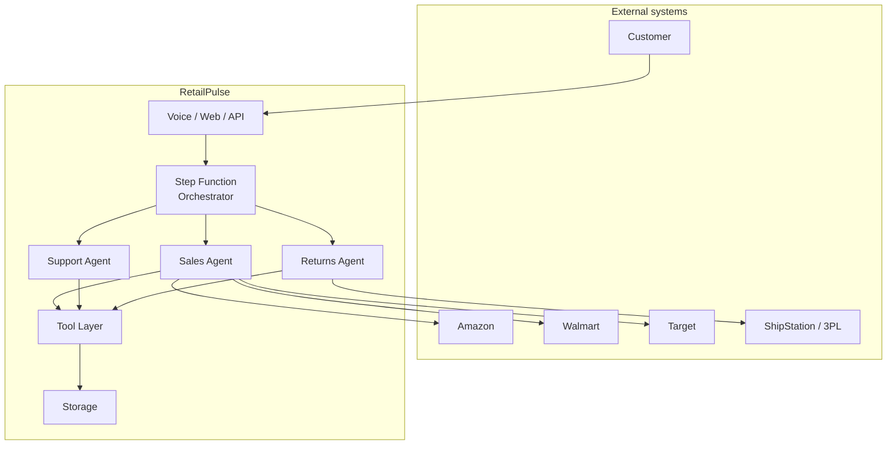
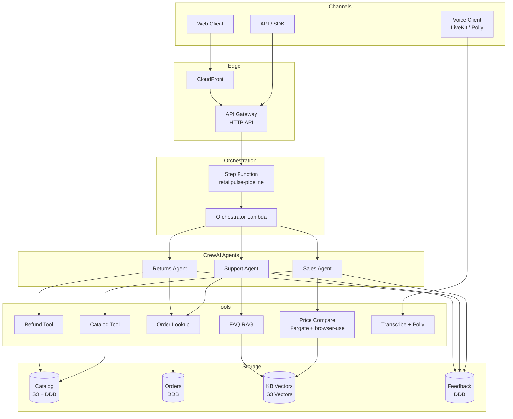

# Architecture Overview

RetailPulse is a serverless, event-driven, multi-agent customer experience suite for retail. Three cooperating agents (Sales, Support, Returns) share a knowledge base, take natural-language requests, and act on a real retail catalog and order history. Config-driven, cloud-portable, voice-enabled.

## System context

## High-level architecture

Full architecture: see [`01-hld.md`](01-hld.md).

## Key flows

### Voice conversation flow

1. Customer speaks → voice gateway → Amazon Transcribe (STT)
2. Text → API Gateway → Step Function → Orchestrator Lambda
3. Orchestrator dispatches to one of 3 agents (Sales/Support/Returns) based on intent
4. Agent calls tools (catalog lookup, price compare, order history, etc.)
5. Agent generates response text → Amazon Polly (TTS) → audio to customer

### Browser price comparison flow

1. Customer asks "is this a good price?"
2. Sales agent invokes `compare_price` tool
3. Tool starts an ECS Run Task with a browser-use container
4. Fargate task launches headless Chromium, navigates Amazon/Walmart/Target
5. Extracts structured price data
6. Returns comparison + recommendation to agent
7. Agent responds to customer

### Returns flow

1. Customer asks "I want to return my order"
2. Returns agent calls `lookup_order` to verify the order
3. Agent checks return policy (RAG over policy docs)
4. If eligible, agent calls `initiate_refund` which calls 3PL API
5. Agent sends confirmation (voice or text)
6. Feedback recorded in DynamoDB

## Why this design

| Concern | Decision | Why |
|---|---|---|
| Multi-agent | CrewAI | First-class multi-agent, role-based prompts, tool-calling |
| AWS integration | Strands Agents | AWS-native, lightweight, complements CrewAI |
| Browser tools | browser-use in Fargate | Real-time data, free, shows agentic capability |
| Storage | S3 Vectors | $0 idle, 1000× cheaper than OpenSearch Serverless |
| Auth | GitHub OIDC | No long-lived secrets, scoped to repo+branch |
| IaC | Terraform | Cloud-portable, mature tooling, recruiter-friendly |
| Voice | Polly + Transcribe | AWS-native, $4/1M chars, good EN-IN voices |
| Embeddings | Titan v2 | Cheapest in-region, multilingual |

## Where to read next

- [HLD](01-hld.md) — service boundaries, deployment topology
- [LLD](02-lld.md) — data shapes, code structure
- [Component diagram](03-component-diagram.md) — module dependencies
- [Data flow](04-data-flow.md) — sequence diagrams
- [Security model](06-security-model.md) — threat model, trust boundaries
- [Cost model](07-cost-model.md) — per-component cost
