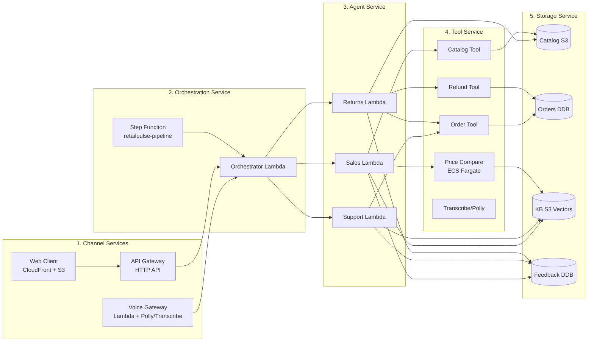
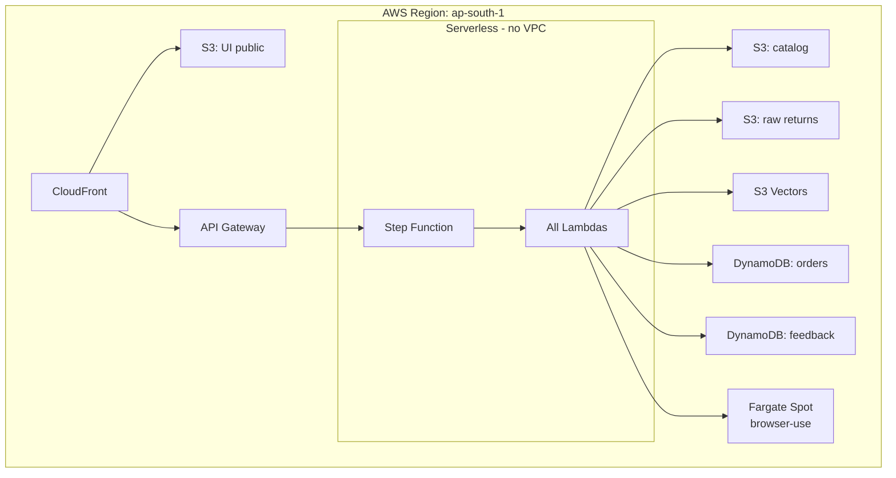

# High-Level Design (HLD)

## Purpose

This document describes the service boundaries, deployment topology, and external interfaces of RetailPulse. It is the **first** level of detail above the [overview](00-overview.md) and **higher** level than the [LLD](02-lld.md).

## Audience

- Engineers integrating with RetailPulse
- Architects reviewing the design
- New team members onboarding
- Recruiters and hiring managers evaluating the work

## Service boundaries

RetailPulse is composed of **5 logical services**, all deployed as AWS managed services:

## Each service, in plain English

### 1. Channel Services

**Responsibility**: Accept customer input in any modality.

- **Voice Gateway** — Amazon Transcribe for STT, Amazon Polly for TTS, wrapped in Lambda
- **Web Client** — Static HTML/JS served from S3 via CloudFront
- **API Gateway** — HTTP API for programmatic access

**SLA**: Voice transcription < 2s; Web API response < 300ms.

### 2. Orchestration Service

**Responsibility**: Decide which agent handles a request and dispatch.

- **Step Function** — State machine for conversation flow
- **Orchestrator Lambda** — Intent classification (Sales/Support/Returns) using Bedrock

**SLA**: Classification < 500ms; handoff < 200ms.

### 3. Agent Service

**Responsibility**: Execute agent logic.

- **Sales Lambda** — CrewAI Sales agent with tools (catalog, price-compare)
- **Support Lambda** — CrewAI Support agent with tools (orders, FAQ)
- **Returns Lambda** — CrewAI Returns agent with tools (orders, refund)

**SLA**: p95 agent response < 3s.

### 4. Tool Service

**Responsibility**: Provide capabilities to agents.

- **Catalog Tool** — Reads from S3 catalog
- **Price Compare Tool** — ECS Fargate task running browser-use
- **Order Tool** — DynamoDB query
- **Refund Tool** — 3PL API call (out of scope for v1)
- **Transcribe/Polly** — Voice TTS/STS

**SLA**: Catalog < 100ms; price-compare < 30s; refund < 5s.

### 5. Storage Service

**Responsibility**: Persist data.

- **Catalog** — S3 (master catalog) + DynamoDB (lookup)
- **Orders** — DynamoDB (per-customer)
- **KB Vectors** — S3 Vectors
- **Feedback** — DynamoDB (for DSPy optimization)

**SLA**: Vector query p95 < 200ms.

## Deployment topology

**Important**: No VPC, no NAT, no always-on compute. Pure serverless + Fargate Spot for the browser tool.

## External interfaces

### Voice

| Method | URI | Auth |
|---|---|---|
| `POST` | `https://api.transcribe.amazonaws.com/...` | IAM (via Lambda) |

### Web/API

| Method | URI | Auth |
|---|---|---|
| `POST` | `/v1/conversations` | IAM SigV4 |
| `GET` | `/v1/conversations/{id}` | IAM |
| `POST` | `/v1/orders/{id}/refund` | IAM |
| `GET` | `/v1/catalog/search` | IAM |

## Failure modes and degradation

| Failure | Impact | Mitigation |
|---|---|---|
| S3 unavailable | Uploads fail | S3 99.99% SLA; client retry |
| Bedrock unavailable | Agent fails | Step Function retries 3×; cached FAQ fallback |
| Fargate unavailable | Price compare fails | Skip comparison, show our price only |
| Polly/Transcribe unavailable | Voice channel fails | Fall back to text channel |
| S3 Vectors unavailable | Search returns nothing | Cached FAQ in DynamoDB fallback |

## What's intentionally NOT in this HLD

- No Kafka/Kinesis — Step Function suffices for our throughput
- No ElastiCache/Redis — S3 Vectors + DynamoDB are fast enough
- No ECS/EKS — Lambdas handle all compute (except Fargate for browser tool)
- No VPC — serverless endpoints; we trust AWS-managed services
- No multi-region — single-region is acceptable for portfolio scope

## See also

- [LLD](02-lld.md) — data shapes, code structure
- [Component diagram](03-component-diagram.md) — module dependencies
- [Data flow](04-data-flow.md) — sequence diagrams
- [Deployment diagram](05-deployment-diagram.md) — AWS topology
- [Security model](06-security-model.md) — threat model, trust boundaries
- [Cost model](07-cost-model.md) — per-component cost
