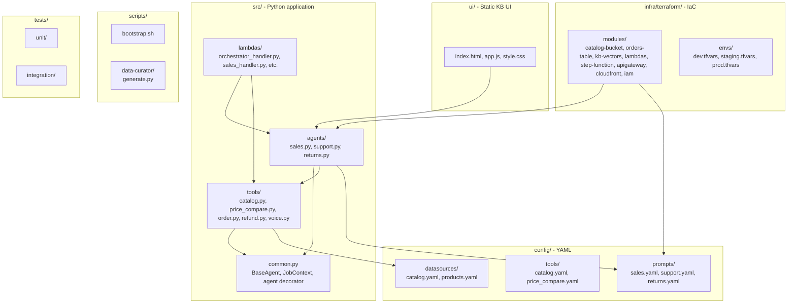
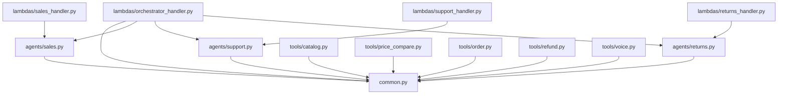
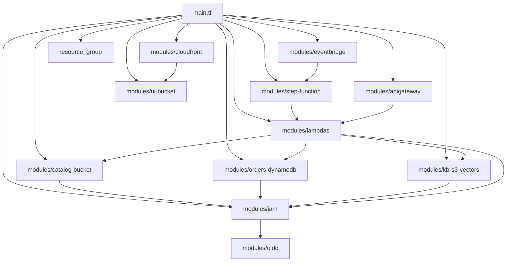
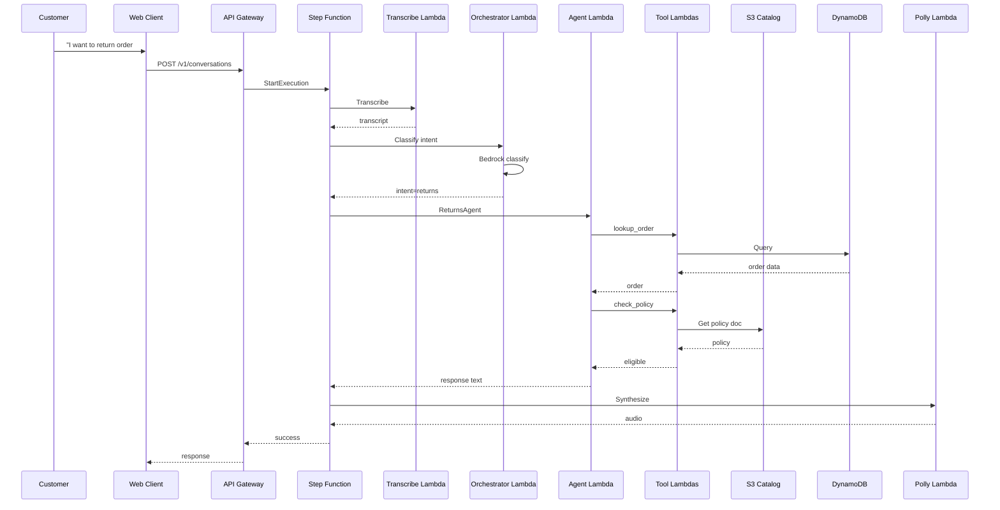
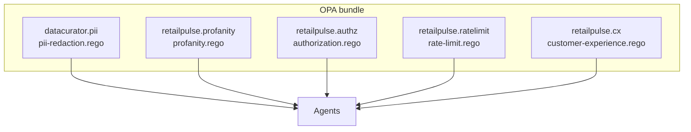

# Component Diagram

## Purpose

This document shows the **internal module structure** of RetailPulse and how the Python source, Terraform, and policies are organized into modules. It complements the [HLD](01-hld.md) (which is service-oriented) by showing the **codebase** structure.

## Repository structure (code modules)



## Python module dependency graph



## Terraform module dependency graph



## Data flow at the component level



## Configuration files

| Config | Validated by | Used by |
|---|---|---|
| `config/datasources/*.yaml` | Pydantic | Tools, agents |
| `config/tools/*.yaml` | Pydantic | Tool definitions |
| `config/prompts/*.yaml` | Pydantic | Agent system prompts |
| `config/embedders/*.yaml` | Pydantic | Embedder selection |
| `policies/*.rego` | `opa test` | Runtime guardrails |
| `infra/terraform/envs/*.tfvars` | `terraform validate` | Environment-specific config |

## OPA policy structure



The OPA bundle is **embedded** in the Lambda deployment package.

## Where each component lives

```
retailpulse-cx-agent/
├── src/
│   ├── common.py                 # BaseAgent, JobContext, @agent decorator
│   ├── agents/
│   │   ├── __init__.py
│   │   ├── sales.py
│   │   ├── support.py
│   │   └── returns.py
│   ├── tools/
│   │   ├── __init__.py
│   │   ├── catalog.py
│   │   ├── price_compare.py       # browser-use in Fargate
│   │   ├── order.py
│   │   ├── refund.py
│   │   └── voice.py               # Transcribe + Polly
│   ├── lambdas/
│   │   ├── __init__.py
│   │   ├── orchestrator_handler.py
│   │   ├── sales_handler.py
│   │   ├── support_handler.py
│   │   └── returns_handler.py
│   └── lambdas_layer/             # Shared layer (CrewAI, Strands)
├── policies/                      # OPA Rego
│   ├── profanity.rego
│   ├── authorization.rego
│   ├── rate-limit.rego
│   └── customer-experience.rego
├── prompts/                       # Agent system prompts
│   ├── sales.yaml
│   ├── support.yaml
│   └── returns.yaml
├── config/                        # YAML configs
│   ├── datasources/
│   ├── tools/
│   ├── embedders/
│   └── prompts/
├── infra/terraform/               # IaC
│   ├── main.tf
│   ├── variables.tf
│   ├── providers.tf
│   ├── data.tf
│   ├── locals.tf
│   ├── modules/
│   │   ├── catalog-bucket/
│   │   ├── orders-dynamodb/
│   │   ├── kb-vectors/
│   │   ├── lambdas/
│   │   ├── step-function/
│   │   ├── eventbridge/
│   │   ├── apigateway/
│   │   ├── cloudfront/
│   │   ├── iam/
│   │   ├── oidc/
│   │   ├── ui-bucket/
│   │   └── resource-group/
│   └── envs/
│       ├── dev.tfvars
│       ├── staging.tfvars
│       └── prod.tfvars
├── ui/                            # KB UI
│   ├── index.html
│   ├── app.js
│   ├── style.css
│   └── README.md
├── scripts/                       # Operational
│   ├── bootstrap.sh               # One-time AWS setup
│   ├── destroy.sh
│   └── verify.sh
├── data-curator/                  # Synthetic data generator
│   └── generate.py
├── tests/
│   ├── unit/
│   ├── integration/
│   └── fixtures/
└── docs/
    ├── architecture/
    ├── adr/
    ├── runbooks/
    └── api/
```

## See also

- [HLD](01-hld.md) — service boundaries
- [LLD](02-lld.md) — data shapes, code structure
- [Data flow](04-data-flow.md) — sequence diagrams
