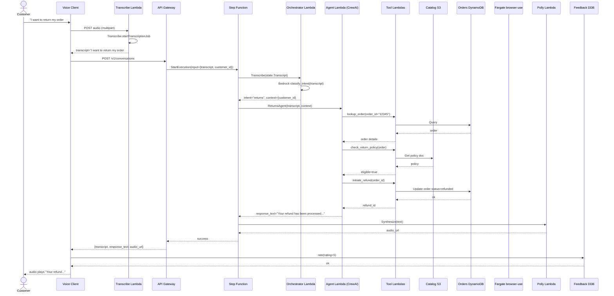
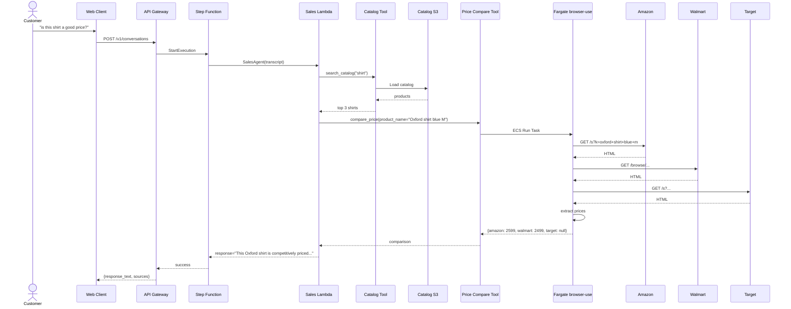
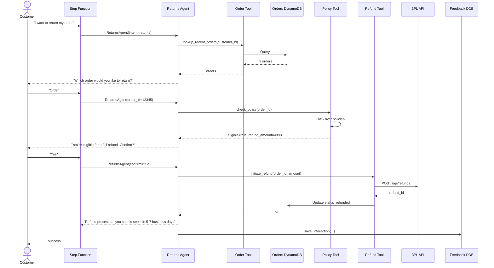

# Data Flow

## Purpose

This document shows the **end-to-end data movement** through RetailPulse — from customer voice/text input to agent response, with every transformation in between. It complements the [HLD](01-hld.md) and [LLD](02-lld.md) by showing **how data changes** as it flows through the system.

## Voice conversation end-to-end



## Sales flow (with price compare)



## Returns flow (with refund)



## Data transformations

| Field | Source | Stage | Stage | Stage | Stage |
|---|---|---|---|---|---|
| `customer_id` | Cognito / API auth | Auth | Pass through | Pass through | - |
| `transcript` | Transcribe | Classify | Agent | - | - |
| `intent` | - | Classify | - | - | - |
| `tool_calls` | - | - | Agent | Tools | - |
| `tool_results` | - | - | - | Tools | Agent |
| `response_text` | - | - | Agent | - | TTS |
| `audio_url` | - | - | - | - | TTS |
| `feedback_rating` | Customer | - | - | - | FB |

## Storage layout

### S3 catalog bucket

```
s3://retailpulse-dev-catalog/
├── master.json              # Full product list (master)
├── categories/              # Category-specific files
│   ├── apparel-men-shirts.json
│   ├── electronics.json
│   └── ...
└── images/                  # Product images (optional)
    ├── SHIRT-001.jpg
    └── ...
```

### DynamoDB tables

```
retailpulse-dev-orders
  PK: customer_id
  SK: order_id
  Attrs: items, total_inr, status, created_at, delivered_at, ...

retailpulse-dev-feedback
  PK: feedback_id
  GSI: session-index (PK: session_id, SK: created_at)
  Attrs: agent, rating, comments, resolved

retailpulse-dev-conversations
  PK: session_id
  GSI: customer-index (PK: customer_id, SK: created_at)
  Attrs: transcript, intent, agent, response, audio_url, duration
```

### S3 Vectors index

```
index: retailpulse-chunks-v1
dimensions: 1024
distance: cosine

vector[chunk_id] = {
  data: { float32: [...] },
  metadata: { source: "...", format: "...", category: "..." }
}
```

## What lives where (storage decision matrix)

| Data type | Store | Why |
|---|---|---|
| Catalog master | S3 | Cheap, durable, large objects |
| Orders | DynamoDB | ACID, queryable, fast lookups |
| Feedback | DynamoDB | ACID, queryable for DSPy training |
| Conversations | DynamoDB | Audit trail, queryable by customer |
| Product vectors | S3 Vectors | Fast similarity search, cheap |
| FAQ/policy vectors | S3 Vectors | Same as product |
| Voice audio (raw) | S3 (transient) | Discarded after transcription |
| TTS audio (cached) | S3 | Cache popular responses |

## See also

- [HLD](01-hld.md) — service boundaries
- [LLD](02-lld.md) — data shapes, code structure
- [Component diagram](03-component-diagram.md) — module dependencies
- [Deployment diagram](05-deployment-diagram.md) — AWS topology
- [API reference](../api/rest-api.md) — external HTTP API
- [Data model](../data-model.md) — entity relationships
