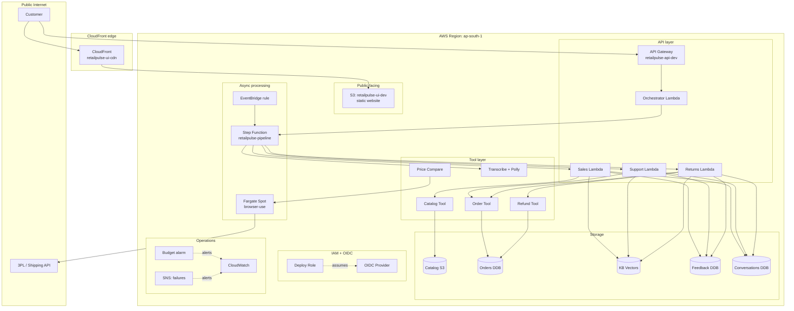
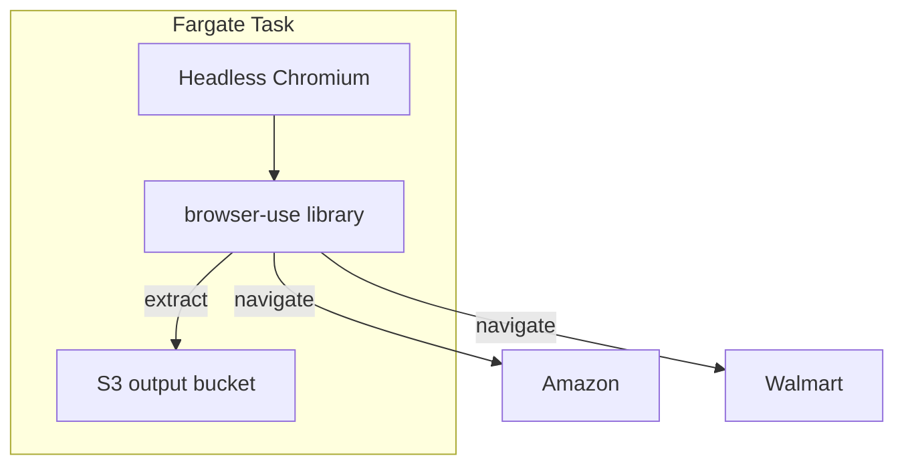

# Deployment Diagram

## Purpose

This document shows the **AWS topology** of a deployed RetailPulse instance — what resources exist in which region/account, how they connect, and the network paths data takes.

## Single-account, single-region deployment



## Resources by AWS service

| Service | Resources | Naming |
|---|---|---|
| S3 | 3 buckets | `retailpulse-{raw,vectors,ui}-dev` |
| S3 Vectors | 1 index | `retailpulse-chunks-v1` (1024-dim, cosine) |
| DynamoDB | 3 tables | `retailpulse-{orders,feedback,conversations}-dev` |
| Lambda | 7 functions | `retailpulse-{detect,parse,chunk,...,orchestrator,sales,support,returns,transcribe,polly}-dev` |
| Step Function | 1 state machine | `retailpulse-pipeline-dev` |
| EventBridge | 1 rule | `retailpulse-s3-trigger-dev` |
| API Gateway | 1 HTTP API | `retailpulse-api-dev` |
| CloudFront | 1 distribution | `retailpulse-ui-cdn-dev` |
| ECS Fargate | 1 task definition | `retailpulse-browser-use-dev` |
| SNS | 1 topic | `retailpulse-failures-dev` |
| CloudWatch | Log groups | `/aws/lambda/retailpulse-*-dev` |
| Budgets | 1 budget | `retailpulse-monthly-dev` |
| IAM | 1 OIDC + 4 roles | `retailpulse-*` |
| Resource Group | 1 group | `rg-retailpulse-dev` |

## Fargate for browser-use



Fargate Spot is used (~$0.01/hr when running). Task boots in ~30s, runs the compare, writes JSON to S3, then dies.

## No VPC by design

This deployment has **no VPC** because:

1. All services are AWS-managed and accessed via service endpoints
2. Lambda functions run in AWS-managed compute (not in a customer VPC)
3. Fargate for browser-use runs in AWS-managed compute (no VPC)
4. Eliminates NAT gateway cost (~$32/month per AZ)
5. Eliminates VPC endpoint complexity for S3, DynamoDB, etc.

If Phase 5 introduces a need for private networking, a VPC would be added at that point.

## Account-wide controls (assumed pre-existing)

These should be set in the AWS Organization or root account, NOT in this Terraform:

- **Service Control Policies (SCPs)** — region restrictions, service denylist
- **AWS Config rules** — required tags, public bucket detection
- **CloudTrail** — organization-wide audit log
- **IAM Access Analyzer** — unused permission detection
- **GuardDuty** — threat detection

## Tagging strategy

Every resource carries:

```hcl
tags = {
  Project     = "retailpulse"
  Environment = "dev"  # dev | staging | prod
  Owner       = "vijay"
  CostCenter  = "portfolio"
  ManagedBy   = "terraform"
}
```

Resource Group `rg-retailpulse-dev` is filter-based:

```text
TagFilters: Project=retailpulse AND Environment=dev
```

## Cross-account deployment

To deploy the same codebase to a second AWS account:

```bash
# In the second account:
bash scripts/bootstrap.sh retailpulse dev ap-south-1 cloud-ai-architect retailpulse-cx-agent

# In your fork's GitHub Actions:
# - Add the same secrets (different role ARN)
# - Push to your fork's main

# In your local clone of the fork:
cd infra/terraform
terraform init -backend-config="bucket=retailpulse-tfstate-second" ...
terraform plan -var-file=envs/dev.tfvars
terraform apply -var-file=envs/dev.tfvars
```

**Time to bootstrap new account: ~2 minutes.** Plus 5–8 min for `init/plan/apply` and GitHub Actions secret updates.

## Disaster recovery

| Disaster | Recovery |
|---|---|
| Region down | Re-deploy to a new region (multi-region is Phase 5) |
| Accidental bucket delete | Versioning + soft delete; restore from previous version |
| Terraform state corruption | Restore from S3 versioning (S3 has 99.999999999% durability) |
| Bad deploy | `terraform apply` previous commit; OIDC allows rapid rollback |
| Compromised GitHub PAT | Rotate GitHub secrets; OIDC scope is by repo so blast radius is small |

## See also

- [HLD](01-hld.md) — service boundaries
- [LLD](02-lld.md) — data shapes, code structure
- [Security model](06-security-model.md) — trust boundaries
- [Cost model](07-cost-model.md) — per-resource cost
- [Bootstrap script](../../scripts/bootstrap.sh) — New-account setup
