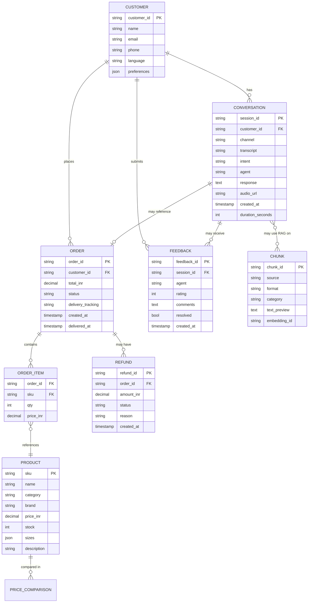
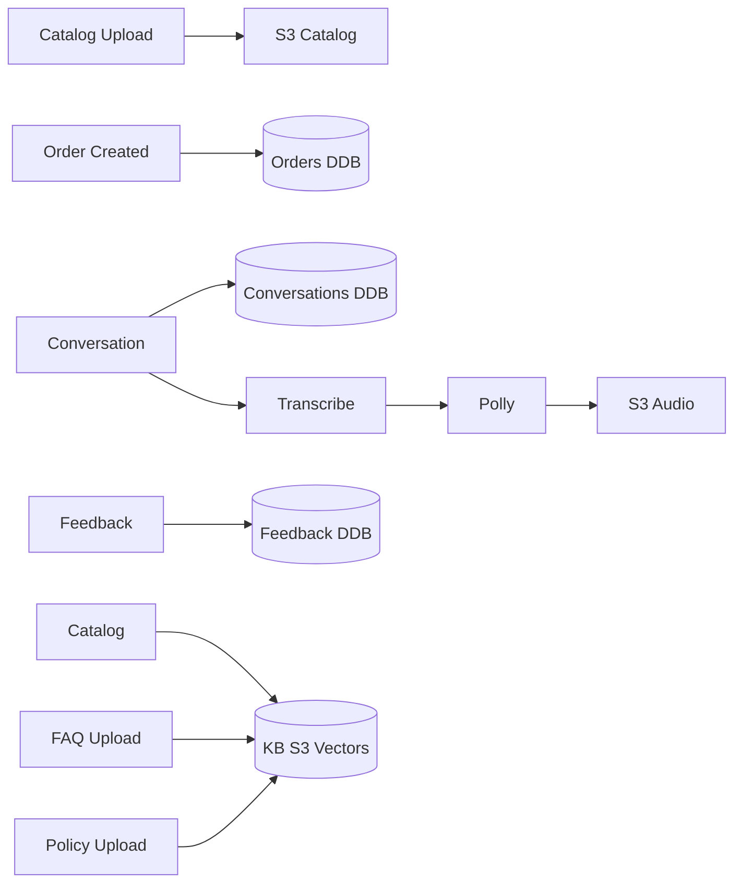

# Data Model

## Entity-relationship overview

## Entities

### Customer

| Field | Type | Required | Description |
|---|---|---|---|
| `customer_id` | UUID | Yes | Primary key |
| `name` | string | No | Full name |
| `email` | string | No | Email address |
| `phone` | string | No | E.164 phone |
| `language` | enum | No | "en-IN", "en-US", "hi-IN" |
| `preferences` | json | No | UI/voice preferences |

### Product (Catalog)

| Field | Type | Required | Description |
|---|---|---|---|
| `sku` | string | Yes | Primary key |
| `name` | string | Yes | Display name |
| `category` | string | Yes | E.g. "apparel/men/shirts" |
| `brand` | string | No | Brand name |
| `price_inr` | decimal | Yes | Price in INR |
| `stock` | int | Yes | Available units |
| `sizes` | json | No | ["S","M","L","XL"] |
| `description` | text | Yes | Long description for RAG |

### Order

| Field | Type | Required | Description |
|---|---|---|---|
| `order_id` | string | Yes | Primary key, "ORD-NNNNNN" |
| `customer_id` | UUID | Yes | Foreign key |
| `total_inr` | decimal | Yes | Total order amount |
| `status` | enum | Yes | "pending","shipped","delivered","cancelled","refunded" |
| `delivery_tracking` | string | No | 3PL tracking URL |
| `created_at` | timestamp | Yes | When order was placed |
| `delivered_at` | timestamp | No | When order was delivered |

### OrderItem

| Field | Type | Required | Description |
|---|---|---|---|
| `order_id` | string | Yes | FK to Order |
| `sku` | string | Yes | FK to Product |
| `qty` | int | Yes | Quantity |
| `price_inr` | decimal | Yes | Price at time of order |

### Conversation

| Field | Type | Required | Description |
|---|---|---|---|
| `session_id` | UUID | Yes | Primary key |
| `customer_id` | UUID | No | FK (null for anonymous) |
| `channel` | enum | Yes | "voice","web","api" |
| `transcript` | text | Yes | What the customer said |
| `intent` | enum | Yes | "sales","support","returns" |
| `agent` | string | Yes | Which agent handled it |
| `response` | text | Yes | What the agent said |
| `audio_url` | string | No | Polly TTS output URL |
| `created_at` | timestamp | Yes | When conversation started |
| `duration_seconds` | int | No | Total length |

### Feedback

| Field | Type | Required | Description |
|---|---|---|---|
| `feedback_id` | UUID | Yes | Primary key |
| `session_id` | UUID | Yes | FK to Conversation |
| `agent` | string | Yes | Which agent was rated |
| `rating` | int | Yes | 1–5 |
| `comments` | text | No | Free text |
| `resolved` | bool | Yes | Was the issue resolved? |
| `created_at` | timestamp | Yes | When feedback submitted |

### Refund

| Field | Type | Required | Description |
|---|---|---|---|
| `refund_id` | UUID | Yes | Primary key |
| `order_id` | string | Yes | FK to Order |
| `amount_inr` | decimal | Yes | Refund amount |
| `status` | enum | Yes | "initiated","processing","completed","failed" |
| `reason` | string | No | Customer reason |
| `created_at` | timestamp | Yes | When initiated |

### Chunk (RAG)

| Field | Type | Required | Description |
|---|---|---|---|
| `chunk_id` | UUID | Yes | Primary key |
| `source` | string | Yes | "catalog","faq","policy" |
| `format` | string | Yes | "json","markdown","pdf" |
| `category` | string | No | "returns","shipping","product" |
| `text_preview` | string | Yes | First 500 chars |
| `embedding_id` | string | Yes | Pointer to S3 Vectors |

## Cardinality

| Relationship | Cardinality | Example |
|---|---|---|
| Customer → Order | 1:N | One customer, many orders |
| Order → OrderItem | 1:N | One order, many items |
| Order → Refund | 0:1 | One order, optional refund |
| OrderItem → Product | N:1 | Many items, one product |
| Customer → Conversation | 1:N | One customer, many conversations |
| Customer → Feedback | 1:N | One customer, many feedback |
| Conversation → Feedback | 1:0..1 | One conversation, optional feedback |

## Data lineage

Every chunk can be traced back to:
- The source object (S3 catalog, FAQ, policy)
- The model version that processed it
- The conversation that used it (if applicable)
- The feedback on that conversation (for DSPy training)

## What is NOT in the data model

- **Raw PII** — never stored unredacted
- **Sensitive credentials** — only in AWS Secrets Manager / SSM
- **Transcripts older than 90 days** — auto-deleted per retention policy
- **Audio recordings older than 30 days** — auto-deleted (storage cost)

## See also

- [LLD](architecture/02-lld.md) — Code-level data shapes
- [Data flow](architecture/04-data-flow.md) — How data moves
- [Security model](architecture/06-security-model.md) — Data protection
- [Cost model](architecture/07-cost-model.md) — Storage cost
